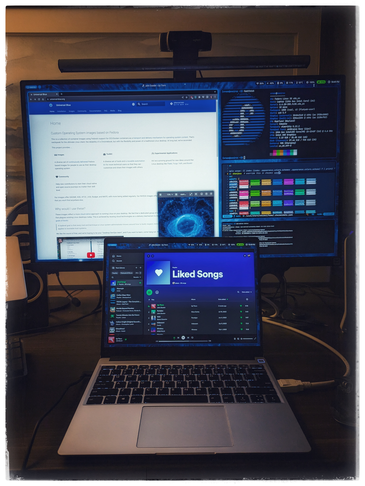

# :milky_way: OneirOS

**OneirOS** is a custom operating system, distributed as an OCI image, and powered by [Fedora Silverblue](https://fedoraproject.org/silverblue/) and the [Universal Blue](https://universal-blue.org/) project.

Image-based distros bring the advantages of cloud-native and DevOps tooling to the desktop -- like CI/CD, atomic deployments, easy rollbacks, and a clean separation between "system" and "state". See the links above for more detailed explanation!

## Status: work in progress

I run this on my Framework laptop and it's working well, but not all of the necessary config files you would need to make this usable are in this repo yet. Stay tuned!

---

